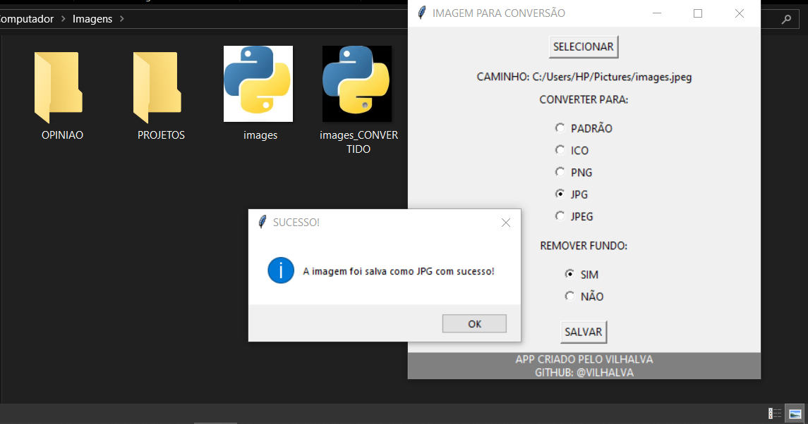

# IMAGEM PARA CONVERSAO
👨‍🏫USE ESSE APP PARA REMOVER O FUNDO DAS SUAS FOTOS E CONVERTER PARA DIVERSOS FORMATOS.

 <br>

## DESCRIÇÃO:
Este aplicativo é uma ferramenta para converter imagens em diferentes formatos e, opcionalmente, remover o fundo das imagens. Desenvolvido com a biblioteca `tkinter`, ele permite ao usuário selecionar uma imagem, escolher o formato de saída e decidir se o fundo da imagem deve ser removido ou não.

## FUNCIONALIDADES:
1. **Seleção de Imagem**:
   - Permite ao usuário selecionar uma imagem do sistema de arquivos para processamento.

2. **Conversão de Formato**:
   - Oferece opções para converter a imagem selecionada para diferentes formatos:
     - **PADRÃO**: Mantém o formato original da imagem.
     - **ICO**: Formato de ícone.
     - **PNG**: Formato de imagem com suporte a transparência.
     - **JPG/JPEG**: Formato de imagem comum sem suporte a transparência.

3. **Remoção de Fundo**:
   - Permite ao usuário escolher se deseja remover o fundo da imagem selecionada:
     - **SIM**: Remove o fundo da imagem.
     - **NÃO**: Mantém o fundo original da imagem.

4. **Salvar Imagem Convertida**:
   - Salva a imagem convertida no formato escolhido com o sufixo "_CONVERTIDO" no mesmo diretório da imagem original.

## EXECUTANDO ESSE PROJETO:
1. **Instalação das Dependências:**
   - Entre no diretório `CODIGO` e execute o comando:

   ```bash
   pip install -r requirements.txt
   ```

2. **Executando o Código:**
   - Para executar o arquivo Python, utilize o comando abaixo no terminal, dentro do diretório `./CODIGO`:

   ```
   python CODIGO.py
   ```

3. **Selecionar uma Imagem**:
   - Clique no botão **SELECIONAR** para abrir uma caixa de diálogo que permite escolher uma imagem do seu sistema de arquivos. O caminho da imagem selecionada será exibido no aplicativo.

4. **Escolher o Formato de Conversão**:
   - Em **CONVERTER PARA**, escolha o formato desejado para a imagem convertida. As opções disponíveis são:
     - **PADRÃO**: Mantém o formato original.
     - **ICO**: Converte para formato de ícone.
     - **PNG**: Converte para formato PNG.
     - **JPG/JPEG**: Converte para formato JPG ou JPEG.

5. **Escolher a Remoção de Fundo**:
   - Em **REMOVER FUNDO**, selecione **SIM** se desejar remover o fundo da imagem, ou **NÃO** se preferir manter o fundo original.

6. **Salvar a Imagem Convertida**:
   - Clique no botão **SALVAR** para processar a imagem conforme as seleções feitas e salvar o resultado no mesmo diretório da imagem original. O botão **SALVAR** será habilitado ou desabilitado automaticamente com base nas suas escolhas.

7. **Verificar o Resultado**:
   - Após salvar a imagem, uma mensagem de sucesso será exibida informando que a imagem foi salva corretamente com o formato escolhido.

## NÃO SABE?
- Entendemos que para manipular arquivos em muitas linguagens, é necessário possuir conhecimento nessas áreas. Para auxiliar nesse aprendizado, oferecemos cursos gratuitos disponíveis:
* [CURSO DE PYTHON](https://github.com/VILHALVA/CURSO-DE-PYTHON)
* [CURSO DE TKINTER](https://github.com/VILHALVA/CURSO-DE-TKINTER)
* [SAIBA MAIS SOBRE O "REMBR"](https://github.com/danielgatis/rembg)
* [CONFIRA MAIS CURSOS](https://github.com/VILHALVA?tab=repositories&q=+topic:CURSO)

## CREDITOS:
- [PROJETO BASEADO NO "IMAGEM PARA ICO"](https://github.com/VILHALVA/IMAGEM-PARA-ICO)
- [PROJETO FEITO PELO VILHALVA](https://github.com/VILHALVA)


